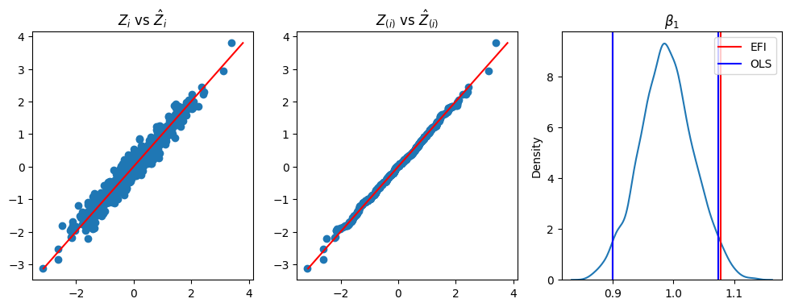

Extended Fiducial Inference: Toward an Automated Process of Statistical Inference
===============

The code includes the experiments of the Extended Fiducial Inference(EFI) by Faming Liang, Sehwan Kim, and Yan Sun. We develop a new statistical inference method called extended Fiducial inference (EFI). 
The new method achieves the goal of fiducial inference by leveraging advanced statistical computing techniques while remaining scalable for big data. Compared to frequentist and Bayesian methods, EFI offers significant advantages in parameter estimation and hypothesis testing. Specifically, EFI provides higher fidelity in parameter estimation, especially when outliers are present in the observations; and eliminates the need for theoretical reference distributions in hypothesis testing, thereby automating the statistical inference process. EFI also provides an innovative framework for semi-supervised learning.

## Related Publication

Faming Liang, Sehwan Kim, and Yan Sun (2024+), [Extended Fiducial Inference: Toward an Automated Process of Statistical Inference](https://arxiv.org/abs/2407.21622), accepted by *Journal of the Royal Statistical Society Series B*

## Description: Linear Regressioin

The notebook `EFI_LinearRegression.ipynb`.describes the application of EFI to the Linear regression problem with known $\sigma$.

    

The above figure presents the results of EFI on Linear Regression: (left) a scatter plot of $\hat{z}_{i}$ (y-axis) versus $z_i$ (x-axis), (middle) a Q-Q plot of $\hat{z}_i$ and $z_i$, and (right) confidence intervals of $\beta_1$ produced by EFI and OLS.

The left panel shows that the imputed random error is quite similar to the true unknown random error. The middle panel demonstrates that the imputed random error exhibits similar distributional behavior to the true random errors. The right panel indicates that the inference from EFI is comparable to that of MLE, Bayes (with objective prior), and Generalized Fiducial Inference.

## Description: Behrens–Fisher problem

The notebook `EFI_BF.ipynb`.describes the application of EFI to the Behrens–Fisher problem. 

    

The above figure presents the results of EFI on Linear Regression: (left) Q-Q plot of $\{\hat{\mu}_1^{(k)}: k=1,2,\ldots M\}$ ($x$-axis)  and $\{\tilde{t}_1^{(k)}: k=1,2,\ldots M \}$ ($y$-axis); (middle) Q-Q plot of $\{\hat{\mu}_2^{(k)}: k=1,2,\ldots \mM\}$  ($x$-axis) and $\{\tilde{t}_2^{(k)}: k=1,2,\ldots M\}$ ($y$-axis) ; (right) Monte Carlo samples of $\hat{\mu}_2-\hat{\mu}_1$ from EFI / Red vertical lines for 2.5 and 97.5 quantiles
